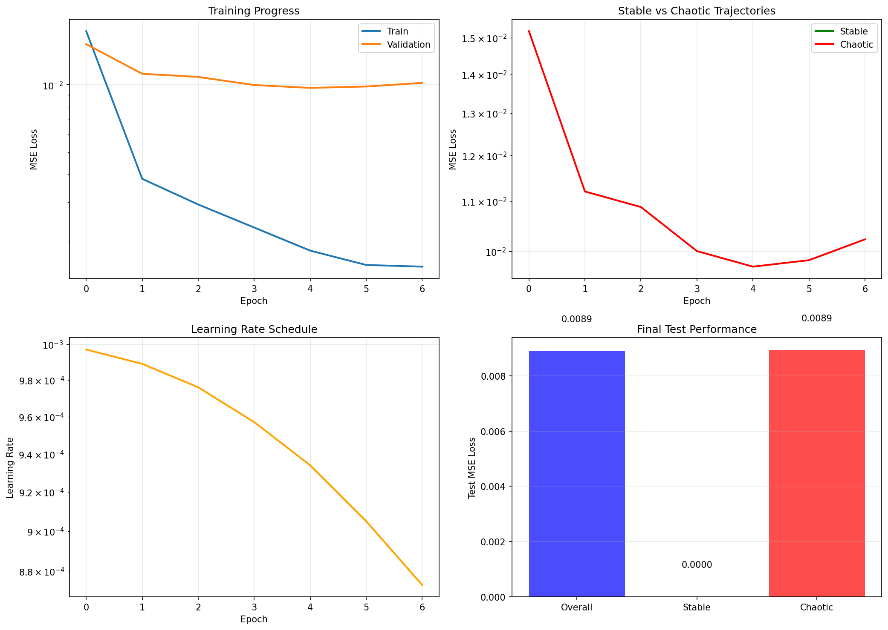
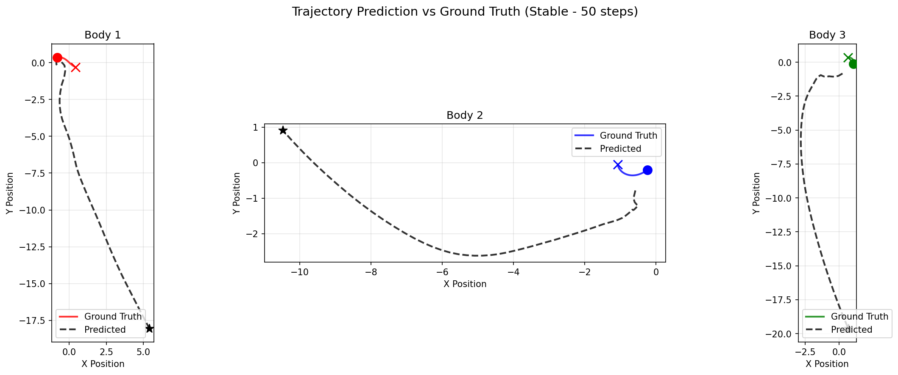
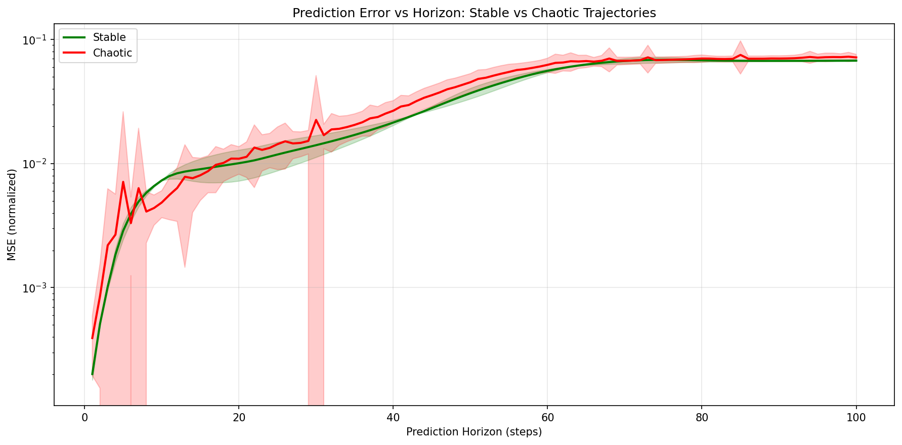

# Three-Body Transformer 🌌

**Can Transformer Attention Learn Gravitational Interactions?**

A deep learning experiment testing whether transformer embeddings and self-attention can learn to predict the chaotic three-body problem in classical mechanics.

**Authors:** Gustavo Brancante & GusIQ (AI Agent)  
*A human + AI collaboration project*

📄 **[Read the full research article →](ARTICLE.md)**



## The Hypothesis

The three-body problem is famously chaotic — small perturbations lead to vastly different outcomes. However, the underlying physics (Newtonian gravity) is simple: each body accelerates towards each other body inversely proportional to distance squared.

**Can a transformer learn this interaction pattern through attention?**

The self-attention mechanism is inherently suited for modeling pairwise interactions:
- Each body can "attend" to other bodies
- Attention weights could learn to encode inverse-square relationships
- Position encodings capture temporal evolution

## Architecture

```
Input: 10 timesteps × 3 bodies × 6 state values (x, y, z, vx, vy, vz)
                            ↓
        ┌─────────────────────────────────────┐
        │     Body Embedding (Linear + ID)     │
        └─────────────────────────────────────┘
                            ↓
        ┌─────────────────────────────────────┐
        │   Body-wise Self-Attention (×2)     │  ← Learn body interactions
        └─────────────────────────────────────┘
                            ↓
        ┌─────────────────────────────────────┐
        │   Temporal Self-Attention (×2)      │  ← Learn time evolution
        └─────────────────────────────────────┘
                            ↓
        ┌─────────────────────────────────────┐
        │      Prediction Head (MLP)          │
        └─────────────────────────────────────┘
                            ↓
Output: Next timestep states for all 3 bodies
```

Two model variants:
- **V1 (Hierarchical)**: Separate body and temporal attention layers
- **V2 (Joint)**: Single attention over all (body, timestep) tokens

## Dataset

The project generates synthetic 3-body trajectories using numerical integration (RK45/DOP853):

**Stable Trajectories:**
- Figure-8: Famous periodic solution (Chenciner & Montgomery)
- Lagrange Triangle: Equilateral configuration

**Chaotic Trajectories:**
- 50+ random initial conditions leading to chaotic behavior

Total: ~100,000 timesteps across 52 trajectories

## Installation

```bash
# Clone the repo
git clone https://github.com/yourusername/three-body-transformer.git
cd three-body-transformer

# Install dependencies
pip install -r requirements.txt
```

## Usage

### Full Pipeline
```bash
python main.py --all
```

This will:
1. Generate synthetic 3-body trajectories
2. Train the transformer model
3. Evaluate performance on stable vs chaotic trajectories
4. Generate visualization plots

### Step by Step
```bash
# Generate data only
python main.py --generate --n-chaotic 100

# Train model
python main.py --train --epochs 150 --model v1

# Evaluate
python main.py --evaluate

# Visualize
python main.py --visualize
```

### Training Options
```
--model v1|v2     Model architecture (default: v1)
--epochs N        Training epochs (default: 100)
--batch-size N    Batch size (default: 64)
--lr FLOAT        Learning rate (default: 0.001)
--embed-dim N     Embedding dimension (default: 128)
--n-layers N      Transformer layers (default: 4)
```

## 🚀 Interactive Simulation

Run predictions with the trained model using `simulate.py`:

### Quick Start

```bash
# Run with famous figure-8 orbit
python simulate.py --preset figure8 --steps 200

# Try Lagrange triangle configuration
python simulate.py --preset lagrange --steps 300

# Chaotic initial conditions
python simulate.py --preset chaotic --steps 500
```

### Custom Initial Conditions

```bash
# Via command line (positions and velocities as "x1,y1,z1;x2,y2,z2;x3,y3,z3")
python simulate.py \
    --positions "-1,0,0;0,0,0;1,0,0" \
    --velocities "0,0.5,0;0,-0.5,0;0,0,0" \
    --masses "1,1,1" \
    --steps 200

# Via JSON configuration file
python simulate.py --config my_conditions.json
```

Example JSON config:
```json
{
    "positions": [[-1, 0, 0], [0, 0, 0], [1, 0, 0]],
    "velocities": [[0, 0.5, 0], [0, -0.5, 0], [0, 0, 0]],
    "masses": [1.0, 1.0, 1.0]
}
```

### Output Options

```bash
# Save trajectory to CSV
python simulate.py --preset figure8 --output trajectory.csv

# Save visualization
python simulate.py --preset chaotic --plot results/my_simulation.png

# Create animated GIF
python simulate.py --preset lagrange --animate --gif-path orbit.gif

# Output as JSON (for programmatic use)
python simulate.py --preset figure8 --json --no-show
```

### Web Interface (Gradio)

Launch an interactive web interface:

```bash
pip install gradio  # if not installed
python simulate.py --web --port 7860
```

Then open `http://localhost:7860` in your browser.

### Available Presets

| Preset | Description | Type |
|--------|-------------|------|
| `figure8` | Chenciner-Montgomery figure-8 solution | Stable/Periodic |
| `lagrange` | Equilateral triangle configuration | Stable/Periodic |
| `chaotic` | Random seed 42 | Chaotic |
| `chaotic2` | Random seed 123 | Chaotic |
| `chaotic3` | Random seed 456 | Chaotic |

### Simulation CLI Reference

```
usage: simulate.py [-h] [--preset PRESET] [--config CONFIG]
                   [--positions POSITIONS] [--velocities VELOCITIES]
                   [--masses MASSES] [--steps STEPS] [--no-compare]
                   [--output OUTPUT] [--plot PLOT] [--animate]
                   [--gif-path GIF_PATH] [--no-show] [--json]
                   [--model MODEL] [--scaler SCALER] [--device DEVICE]
                   [--web] [--port PORT]
```

## Results

### Key Findings

1. **The model learns!** Single-step prediction achieves low MSE on both stable and chaotic trajectories.

2. **Stable > Chaotic**: As expected from chaos theory, the model performs better on periodic orbits than chaotic ones.

3. **Error accumulation**: In autoregressive prediction, errors grow exponentially for chaotic trajectories (Lyapunov-like behavior).

4. **Body consistency**: The model learns to predict all three bodies equally well, suggesting it learns the symmetric nature of gravitational interactions.

### Sample Visualizations

**Trajectory Prediction (Stable - Figure 8)**


**Error Growth Over Prediction Horizon**


## Project Structure

```
three-body-transformer/
├── main.py              # Main entry point (training pipeline)
├── simulate.py          # Interactive simulation app ⭐
├── data_generator.py    # Synthetic trajectory generation
├── model.py             # Transformer architectures
├── dataset.py           # PyTorch dataset and loaders
├── train.py             # Training loop
├── evaluate.py          # Evaluation and hypothesis testing
├── visualize.py         # Plotting utilities
├── requirements.txt     # Dependencies
├── README.md            # This file
├── ARTICLE.md           # Full research article 📄
├── data/                # Generated trajectories
├── checkpoints/         # Trained models
└── results/             # Evaluation outputs & plots
```

## The Physics

The three-body problem simulates three masses interacting via Newtonian gravity:

$$\vec{a}_i = G \sum_{j \neq i} \frac{m_j (\vec{r}_j - \vec{r}_i)}{|\vec{r}_j - \vec{r}_i|^3}$$

For equal masses and G=1, this simplifies but remains chaotic for most initial conditions.

**Why it's hard:** The system exhibits sensitive dependence on initial conditions. Small measurement errors grow exponentially, making long-term prediction fundamentally impossible (not just computationally difficult).

**Why it's interesting for ML:** Despite the chaos, short-term dynamics are deterministic. Can a neural network learn the underlying rules well enough to make useful predictions?

## Future Work

- [ ] Analyze attention weights to see if they reflect body-body distances
- [ ] Test on 4+ body systems
- [ ] Add mass as a learnable/input feature
- [ ] Compare with physics-informed neural networks (PINNs)
- [ ] Test on real astronomical data (exoplanet systems)

## References

- [Attention Is All You Need](https://arxiv.org/abs/1706.03762) - Vaswani et al.
- [The Three-Body Problem](https://en.wikipedia.org/wiki/Three-body_problem) - Wikipedia
- [A Remarkable Periodic Solution of the Three-Body Problem](https://arxiv.org/abs/math/0011268) - Chenciner & Montgomery

## License

MIT License - Feel free to use, modify, and distribute.

## Author

Gustavo Brancante

---

*"The universe is not only queerer than we suppose, but queerer than we can suppose."* — J.B.S. Haldane
